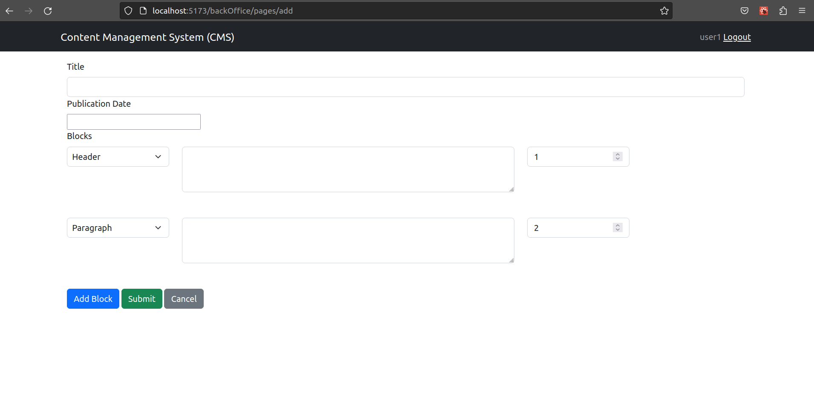
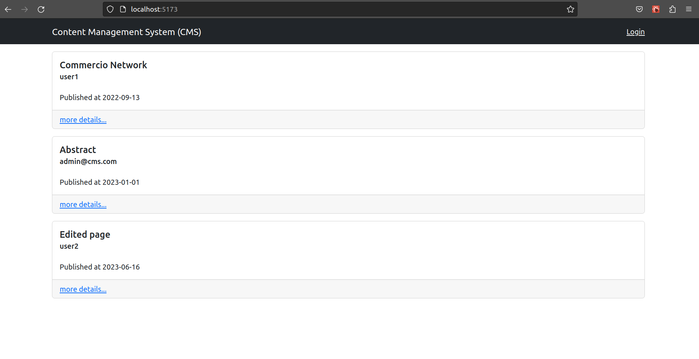

[](https://classroom.github.com/a/_XpznRuT)
# Exam #1: "CMSmall"

## Student: s317390 FALL SERIGNE CHEIKH TIDIANE SY 

# Server side

## API Server

API Server:

- POST `/api/login`
  - Request parameters: None
  - Request body content: 
    - An object having a field `"username"` containing the user's username and a field `"password"` containing the user's password.
  - Response body content:
    - An object having fields `"id"`, `"username"`, and `"role"` containing the saved information of the user.

- POST `/api/logout`
  - Request parameters: None
  - Request body content: None
  - Response body content:
    - An object with a field `"message"` indicating that the user has been logged out.

- GET `/api/verifyAuth`
  - Request parameters: None
  - Request body content: None
  - Response body content:
    - If the user is authenticated:
      - An object containing the user's information.
    - If the user is not authenticated:
      - An object with a field `"error"` indicating that the user is not authenticated.

- GET `/api/pages`
  - Request parameters: None
  - Request body content: None
  - Response body content:
    - An array of pages containing their information.
    - Example:
      ```
      [
        {"id": 1, "title": "Page 1", "author": "user1", "publication_date": "2023-06-20"},
        {"id": 2, "title": "Page 2", "author": "user2", "publication_date": "2023-06-21"}
      ]
      ```

- GET `/api/pages/:pageId`
  - Request parameters: `pageId` - The ID of the page.
  - Request body content: None
  - Response body content:
    - The information of the requested page.

- GET `/api/websiteName`
  - Request parameters: None
  - Request body content: None
  - Response body content:
    - An object with a field `"name"` containing the name of the website.

- POST `/api/pages`
  - Request parameters: None
  - Request body content:
    - The `"publication_date"` field contains the publication date of the page to create.
    - The `"blocks"` field contains an array of blocks that belong to the page to be created. Each block has fields `"type"`, `"content"`, and `"position"`.
    - Example:
      ```
      {
        "title": "New Page",
        "publication_date": "2023-06-24",
        "blocks": [
          {"type": "Header", "content": "Welcome to the new page", "position": 1},
          {"type": "Paragraph", "content": "This is some new content.", "position": 2}
        ]
      }
      ```
  - Response body content:
    - An object `{page: data, blockIds: blockIds}`

- PUT `/api/pages/:pageId`
  - Request parameters: `pageId` - The ID of the pageto edit.
  - Request body content:
    - An object with fields `"title"`, `"publication_date"`, and `updateBlocks`, `deleteBlocks`, `addBlocks` arrays.
    - Example:
      ```
      {
        "title": "Updated Page",
        "publication_date": "2023-06-25",
        "updateBlocks": [],
        "deleteBlocks":[],
        "addBlocks": []
      }
      ```
  - Response body content:
    - An object with a field `"message"` indicating that the page has been updated.

- DELETE `/api/pages/:pageId`
  - Request parameters: `pageId` - The ID of the page to be deleted.
  - Request body content: None
  - Response body content:
    - An object with a field `"message"` indicating that the page has been deleted.

- PUT `/api/websiteName`
  - Request parameters: None
  - Request body content:
    - An object with a field `"name"` containing the new name for the website.
  - Response body content:
    - An object with a field `"message"` indicating that the website name has been updated.

- PUT `/api/admin/:pageId/updateAuthor`
  - Request parameters: `pageId` - The ID of the page.
  - Request body content:
    - An object with a field `"author"` containing the new author name for the page.
  - Response body content:
    - An object with a field `"message"` indicating that the author name has been updated.

- GET `/api/admin/user/:username`
  - Request parameters: `username` - The username of the user to retrieve.
  - Request body content: None
  - Response body content:
    - An object containing the user information or `User not found.` error


## Database Tables

- Table `Blocks` - contains (
	"id"	INTEGER,
	"type"	TEXT NOT NULL,
	"content"	TEXT NOT NULL,
	"idPage"	INTEGER NOT NULL,
	"position"	INTEGER NOT NULL,
	PRIMARY KEY("id" AUTOINCREMENT),
	FOREIGN KEY("idPage") REFERENCES "Pages"("id")
)
- Table `Pages` - contains (
	"id"	INTEGER,
	"title"	TEXT NOT NULL,
	"author"	TEXT NOT NULL,
	"date"	TEXT NOT NULL,
	"publication_date"	TEXT,
	PRIMARY KEY("id" AUTOINCREMENT),
	FOREIGN KEY("author") REFERENCES "Users"("username")
)
- Table `Users` - contains (
	"id"	INTEGER,
	"username"	TEXT NOT NULL UNIQUE,
	"password"	TEXT NOT NULL,
	"salt"	TEXT NOT NULL,
	"role"	INTEGER DEFAULT 'regular',
	PRIMARY KEY("id" AUTOINCREMENT)
)
- Table `Website` - contains (
	"name"	TEXT NOT NULL,
	PRIMARY KEY("name")
)

# Client side


## React Client Application Routes

- Route `/`: PagesList => list of pages
- Route `/login`: LoginForm => perform login
- Route `/pages/:pageId`: PageWithBlocks => list page information with his blocks. `:pageId` is the id of the page
- Route `/backOffice/pages`: PagesListBackOffice => list of pages with back-office tools
- Route `/backOffice/pages/add`: AddPageBackOffice => create new page
- Route `/backOffice/pages/:pageId/edit`: EditPageBackOffice => edit page with id equal to `:pageId`
- Route `/backOffice/admin/:pageId/changeAuthor`: ChangeAuthorForm => admin change author of a page with id equal to `:pageId`
- Route `*`: PageNotFound


## Main React Components

- `PagesList` (in `PagesList.jsx`): List of pages chronologically
- `PageWithBlocks` (in `Blocks.jsx`): renders page informations and all his blocks. Contains editpage button.
- `PagesListBackOffice` (in `PagesList.jsx`): list of pages by author with back-office tools as createPage, editPage and deletePage
- `ManagePageBackOffice` (in `ManagePageBackOffice.jsx`): used for createPage and editPage. It performs also the validation of input datas
- `ChangeAuthorForm` (in `ChangeAuthorForm.jsx`): form for the admin to change the author of a page

(only _main_ components, minor ones may be skipped)

# Usage info

## Example Screenshot
- screen for creating a new page

- screen with the list of all pages


## Users Credentials

- user1, guess_my_password
- user2, isSecret
- admin@cms.com, secureAdmin
- user3@emailcom, password

